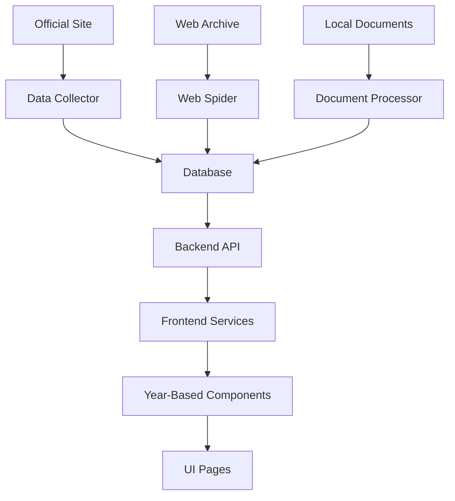

# Database, Backend, and Frontend Integration Plan

## 🎯 Project Overview

The Carmen de Areco Transparency Portal aims to provide citizens with easy access to government financial data, organized by year with reliable data sources and automated collection.

## 🏗️ Current Architecture

### Frontend (React + TypeScript + Vite)
- Located in `/frontend/`
- Year-based data switching implemented
- Uses mock/generated data for demonstration
- Data services for year management and validation

### Backend (Node.js + Express + PostgreSQL)
- Located in `/backend/`
- API endpoints defined for all data types
- Database schema created but not populated
- Models and controllers implemented

### Data Organization
- Local data stored in `/data/source_materials/`
- Organized by year (2018-2025) and category
- 700+ PDF documents available

## 🗃️ Database Backend Plan

### 1. PostgreSQL Database Setup

#### Connection Configuration
- Create `.env` file in `/backend/`:
```env
DB_HOST=localhost
DB_PORT=5432
DB_NAME=transparency_portal
DB_USER=postgres
DB_PASSWORD=your_password
PORT=3000
NODE_ENV=development
```

#### Database Initialization
1. Create database:
```sql
CREATE DATABASE transparency_portal;
```

2. Run initialization script:
```bash
cd backend
psql -U postgres -d transparency_portal -f init.sql
```

### 2. Data Population Strategy

#### Phase 1: Import Existing Local Data
- Parse PDF documents in `/data/source_materials/`
- Extract structured data using document analysis
- Populate database tables with extracted information

#### Phase 2: Automated Data Collection
- Implement web crawlers for official site and Web Archive
- Schedule regular data synchronization
- Validate and cross-reference collected data

#### Phase 3: Live Data Integration
- Connect frontend to backend API
- Implement real-time data fetching
- Add data validation and caching

## 🔌 Backend API Implementation

### Current Status
- ✅ API routes defined for all data types
- ✅ Controllers and models created
- ❌ Database not populated with real data
- ❌ API endpoints not tested with real data

### Next Steps
1. Populate database with sample data
2. Test all API endpoints
3. Implement data validation in controllers
4. Add error handling and logging
5. Implement authentication (if needed)

### Example API Usage
```bash
# Get all property declarations
curl http://localhost:3000/api/declarations

# Get declarations for a specific year
curl http://localhost:3000/api/declarations/year/2024

# Get declarations for a specific official
curl http://localhost:3000/api/declarations/official/"John Doe"
```

## 🖥️ Frontend Integration

### Current Status
- ✅ Year-based data switching implemented
- ✅ Mock data services working
- ❌ Backend API integration not implemented
- ❌ Real data not connected

### Integration Plan

#### 1. Update Data Services
Modify `/frontend/src/services/DataService.ts` to fetch from backend API:

```typescript
// Before: Using mock data
const budgetData2024 = await import('../data/budget-data');

// After: Using API calls
const response = await fetch('/api/reports/year/2024');
const budgetData2024 = await response.json();
```

#### 2. Environment Configuration
Update `/frontend/.env`:
```env
VITE_API_URL=http://localhost:3000/api
```

#### 3. API Service Implementation
Create `/frontend/src/services/ApiService.ts`:
```typescript
const API_BASE_URL = import.meta.env.VITE_API_URL || '/api';

export const apiService = {
  async getDeclarations(year?: string) {
    const url = year 
      ? `${API_BASE_URL}/declarations/year/${year}`
      : `${API_BASE_URL}/declarations`;
    const response = await fetch(url);
    return response.json();
  },

  async getSalaries(year?: string) {
    const url = year 
      ? `${API_BASE_URL}/salaries/year/${year}`
      : `${API_BASE_URL}/salaries`;
    const response = await fetch(url);
    return response.json();
  },

  // Similar methods for other data types...
};
```

## 📁 Data Organization Strategy

### 1. Year-Based Directory Structure
```
/data/source_materials/
├── 2022/
│   ├── budget/
│   ├── tenders/
│   ├── declarations/
│   └── reports/
├── 2023/
├── 2024/
├── 2025/
└── cross_year/
    ├── officials/
    ├── contracts/
    └── assets/
```

### 2. Document Categorization
- Budget Documents: `presupuesto`, `ejecucion`, `balance`
- Contracts: `licitacion`, `contrato`, `adjudicacion`
- Declarations: `declaracion`, `patrimonio`, `ddjj`
- Reports: `informe`, `auditoria`, `memoria`
- Resolutions: `resolucion`, `decreto`, `ordenanza`

### 3. Metadata Management
Each document should have metadata:
- Year
- Category
- Title
- Date
- Source URL
- File path
- Hash for integrity verification

## 🕷️ Automated Data Collection

### 1. Official Site Crawler
Script: `/frontend/scripts/data-collector.js`
- Downloads documents from `carmendeareco.gob.ar/transparencia/`
- Categorizes and organizes by year/type
- Updates local database

### 2. Web Archive Spider
Script: `/frontend/scripts/web-spider.js`
- Crawls `archive.org` snapshots
- Retrieves historical versions
- Cross-references with current data

### 3. Data Synchronization
Script: `/frontend/scripts/data-sync.js`
- Runs daily synchronization
- Compares document hashes
- Reports discrepancies
- Updates database with new/changed data

## 🚀 Implementation Roadmap

### Phase 1: Database and Backend (Week 1)
1. Set up PostgreSQL database
2. Run initialization script
3. Populate with sample data
4. Test all API endpoints
5. Implement basic data validation

### Phase 2: Frontend Integration (Week 2)
1. Update data services to use API
2. Implement year-based data fetching
3. Add loading states and error handling
4. Test all pages with real data
5. Implement data validation in frontend

### Phase 3: Data Organization (Week 3)
1. Organize local documents by year/category
2. Create document metadata system
3. Implement document categorization
4. Set up automated collection scripts
5. Test data synchronization

### Phase 4: Advanced Features (Week 4)
1. Implement cross-source validation
2. Add data integrity monitoring
3. Create backup and restore system
4. Implement advanced search
5. Add data export capabilities

## 🛠️ Technical Requirements

### Backend
- Node.js v16+
- PostgreSQL v12+
- Express.js
- Sequelize ORM

### Frontend
- Node.js v16+
- npm v8+
- Modern browser support

### Data Processing
- PDF parsing libraries
- Web crawling tools
- Data validation utilities

## 📊 Data Flow Architecture



## 🔍 Validation and Monitoring

### Data Validation
- Cross-source verification
- Temporal consistency checks
- Completeness scoring
- Hash-based integrity verification

### Monitoring
- Data source health checks
- Sync status monitoring
- Error detection and alerting
- Performance metrics

## 🎯 Success Criteria

1. ✅ Database populated with real municipal data
2. ✅ Backend API serving real data
3. ✅ Frontend fetching data from backend
4. ✅ Year switching works with real data
5. ✅ Data validation and cross-referencing implemented
6. ✅ Automated data collection working
7. ✅ Document preview system functional

## 🚨 Risks and Mitigations

### Risk: Official site changes structure
**Mitigation:** Implement flexible parsing with Web Archive fallback

### Risk: Data inconsistency between sources
**Mitigation:** Cross-reference and flag discrepancies

### Risk: Large document processing overhead
**Mitigation:** Implement caching and lazy loading

### Risk: Database performance issues
**Mitigation:** Add indexing and query optimization

## 📅 Timeline

| Week | Focus Area | Deliverables |
|------|------------|--------------|
| 1 | Database & Backend | Working API with sample data |
| 2 | Frontend Integration | UI connected to real backend |
| 3 | Data Organization | Organized documents and metadata |
| 4 | Advanced Features | Validation, monitoring, backups |

## 💡 Key Benefits

- ✅ Reliable data from multiple sources
- ✅ Year-based data switching with real data
- ✅ Automated data collection and synchronization
- ✅ Data integrity verification
- ✅ Document preview with contextual data
- ✅ Scalable architecture for future expansion