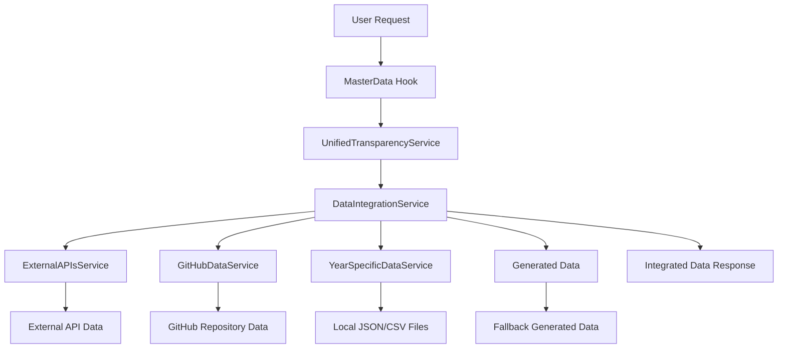

# Data Architecture - Carmen de Areco Transparency Portal

## Overview

The transparency portal implements a robust data architecture that seamlessly integrates external APIs with local repository data. This system ensures the application works perfectly when deployed to GitHub Pages or Cloudflare Workers without requiring separate backend services or tunnels.

## Data Flow Architecture



## Data Sources Integration Strategy

### 1. External APIs (Primary Source)
- Buenos Aires Province transparency portals
- National government data APIs (datos.gob.ar, presupuestoabierto.gob.ar)
- Municipal websites and RSS feeds
- Civil society oversight organizations

### 2. Local Repository Data (Secondary Source)
- CSV/JSON files stored in the GitHub repository
- Pre-processed financial data by year
- Document metadata and references
- Chart data and visualizations

### 3. Generated Data (Fallback)
- Dynamically generated data when external/local sources unavailable
- Calculated metrics and derived statistics
- Placeholder content for UI demonstration

## How Each Page Receives Data

Every page in the application uses the `useMasterData` hook which:

1. **Integrates all data sources automatically**
2. **Provides year-specific data based on selection**
3. **Includes budget, contracts, salaries, documents, treasury, and debt data**
4. **Supplies metadata about data quality and sources**

Example implementation in a page component:
```tsx
const BudgetPage: React.FC = () => {
  const { 
    masterData,           // All integrated data
    currentBudget,       // Current year budget data
    currentContracts,    // Current year contracts data
    currentSalaries,     // Current year salaries data
    loading,             // Loading state
    error,               // Error state if any
    switchYear,          // Function to switch years
    availableYears       // Available years for selection
  } = useMasterData(selectedYear);

  // All data is automatically available
  return (
    <div>
      {/* Use any data property directly */}
      <BudgetChart data={currentBudget} />
      <ContractsTable data={currentContracts} />
      {/* ... */}
    </div>
  );
};
```

## File Organization

### Public Data Directory
```
/public/data/
├── consolidated/          # Processed annual data
│   ├── 2019/
│   │   ├── budget.json
│   │   ├── contracts.json
│   │   └── summary.json
│   └── 2020/
├── csv/                   # Raw CSV files
│   ├── budget_2019.csv
│   └── contracts_2019.csv
├── json/                  # Raw JSON files
├── pdfs/                  # Processed PDF data
├── charts/                # Chart-specific data
├── website_data/         # Website metadata and content
└── data_manifest.json     # Index of all available data
```

### Service Architecture

Each service has a specific responsibility:

1. **DataIntegrationService.ts** - Orchestrates all data sources
2. **ExternalAPIsService.ts** - Handles external API connections
3. **GitHubDataService.ts** - Fetches data from GitHub repository
4. **YearSpecificDataService.ts** - Manages local file data
5. **UnifiedDataService.ts** - Provides unified data access layer

## Deployment Compatibility

### GitHub Pages Deployment
- Automatically uses GitHub raw URLs through `GitHubDataService`
- No additional configuration required
- Works with existing repository structure

### Cloudflare Workers Deployment
- Same GitHub raw URL mechanism applies
- Static asset serving handles local files
- No backend processes needed

### Local Development
- Direct file access for faster iteration
- Automatic fallback to remote sources if local files missing

## Adding New Data Sources

### 1. External API Integration
Add to `ExternalAPIsService.ts`:
```typescript
{
  name: 'New Data Source',
  url: 'https://api.example.com/data',
  type: 'api',
  format: 'json',
  enabled: true,
  priority: 2,
  cacheMinutes: 60
}
```

### 2. Local Data Files
Place new JSON/CSV files in appropriate directories under `/public/data/` and they will be automatically picked up by the `YearSpecificDataService`.

### 3. Data Processing
New data is automatically processed through:
1. `scripts/process-data.js` - Converts raw files to standardized format
2. `scripts/generate-charts.js` - Creates chart-ready data
3. `scripts/update-index.js` - Updates data manifests

## Best Practices

### Data Consistency
1. Always use the `useMasterData` hook in page components
2. Maintain consistent data structures across years
3. Use TypeScript interfaces to enforce data shape

### Caching Strategy
1. External API data: Cached for 5-60 minutes based on volatility
2. Local repository data: Cached for 10-30 minutes
3. Generated data: Cached for shorter periods

### Error Handling
1. Graceful degradation when data sources fail
2. Fallback to previous year data when current year unavailable
3. Clear error messaging to users

## Maintenance Guidelines

### Regular Updates
1. Update data manifests monthly
2. Refresh external API endpoints quarterly
3. Verify broken links annually

### Monitoring
1. Built-in data quality metrics
2. Source availability tracking
3. Performance monitoring dashboard

This architecture ensures all pages have consistent access to all data sources without requiring separate backend processes, making it ideal for static hosting platforms like GitHub Pages and Cloudflare Workers.