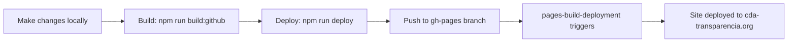

# ✅ Deployment Setup Complete

**Date:** October 4, 2025
**Status:** Successfully Configured

## Summary

Your GitHub Pages deployment is now properly configured and working! The site is live at **https://cda-transparencia.org**.

## Active Deployment Workflow

### Primary Workflow: `pages-build-deployment`
- **Type:** GitHub's automatic deployment workflow
- **Trigger:** Automatically runs when you push to the `gh-pages` branch
- **Status:** ✅ Working perfectly
- **Latest deployment:** Completed in 30 seconds (Oct 4, 2025 at 10:02 UTC)

## How Deployment Works



### Step-by-Step Deployment Process

1. **Make your changes** in the `main` branch
2. **Navigate to frontend directory:**
   ```bash
   cd frontend
   ```
3. **Deploy to GitHub Pages:**
   ```bash
   npm run deploy
   ```
   This automatically:
   - Runs data preprocessing scripts
   - Builds the frontend with production settings
   - Pushes to `gh-pages` branch
   - Triggers the `pages-build-deployment` workflow

4. **Monitor deployment:**
   ```bash
   gh run list --workflow="pages-build-deployment"
   ```

## Disabled Workflows

To prevent conflicts, the following workflows are disabled (manual only):

- ✅ `.github/workflows/deploy.yml` - Disabled
- ✅ `.github/workflows/pages.yml` - Disabled
- ✅ `.github/workflows/cloudflare-deploy.yml` - Disabled
- ✅ `.github/workflows/release.yml` - Disabled

## Active Workflows (Code Quality)

These workflows still run on push to `main`:

- ✅ `backend-ci.yml` - Backend tests
- ✅ `frontend-ci.yml` - Frontend tests
- ✅ `python-ci.yml` - Python tests
- ✅ `build.yml` - Build verification
- ✅ `codacy.yml` - Security scanning
- ✅ `CodeQL` - Code analysis

## Current Configuration

### GitHub Pages
- **Source:** `gh-pages` branch (root directory)
- **Custom domain:** `cda-transparencia.org`
- **HTTPS:** Available (recommend enabling enforcement)
- **Build type:** Legacy (automatic)

### DNS (Cloudflare)
- **Domain:** `cda-transparencia.org`
- **DNS provider:** Cloudflare
- **IP addresses:** 104.21.83.15, 172.67.166.199
- **Features:** CDN, caching, DDoS protection, SSL/TLS

### Build Configuration
The project uses different build modes:
- `npm run build:github` → Builds with base path `/cda-transparencia/`
- `npm run build:production` → Builds with base path `/`
- `npm run build` → Builds with production settings

## Verification

✅ **Site is live:** https://cda-transparencia.org
✅ **DNS resolving correctly:** Cloudflare CDN
✅ **Latest deployment:** Oct 4, 2025 at 10:02 UTC
✅ **Deployment time:** ~30 seconds
✅ **All workflows disabled except pages-build-deployment**

## Monitoring & Troubleshooting

### Check Deployment Status
```bash
# View recent deployments
gh run list --workflow="pages-build-deployment" --limit 5

# Watch a deployment in progress
gh run watch

# View deployment logs
gh run view --log
```

### Common Issues

#### Site not updating
1. Check deployment succeeded: `gh run list --workflow="pages-build-deployment"`
2. Clear Cloudflare cache if needed
3. Try hard refresh in browser (Ctrl+Shift+R / Cmd+Shift+R)

#### Build fails locally
1. Ensure you're in the frontend directory
2. Run `npm install` to update dependencies
3. Check for syntax errors in code

#### Deploy fails
1. Ensure gh-pages package is installed: `npm install --save-dev gh-pages`
2. Check you have write access to the repository
3. Try force deploy: `npm run deploy:force`

## Next Steps (Optional)

1. **Enable HTTPS enforcement:**
   - Go to GitHub repository Settings → Pages
   - Check "Enforce HTTPS"

2. **Optimize build size:**
   - Current main bundle: 1.7 MB (gzip: 412 KB)
   - Consider code splitting for further optimization

3. **Set up monitoring:**
   - Add uptime monitoring (e.g., UptimeRobot)
   - Set up analytics (e.g., Google Analytics, Plausible)

## Support

For deployment issues, see:
- [DEPLOYMENT.md](DEPLOYMENT.md) - Full deployment documentation
- [GitHub Pages docs](https://docs.github.com/en/pages)
- [Issue tracker](https://github.com/flongstaff/cda-transparencia/issues)

---

**Last updated:** October 4, 2025
**Configured by:** Claude Code
**Status:** ✅ Production Ready
