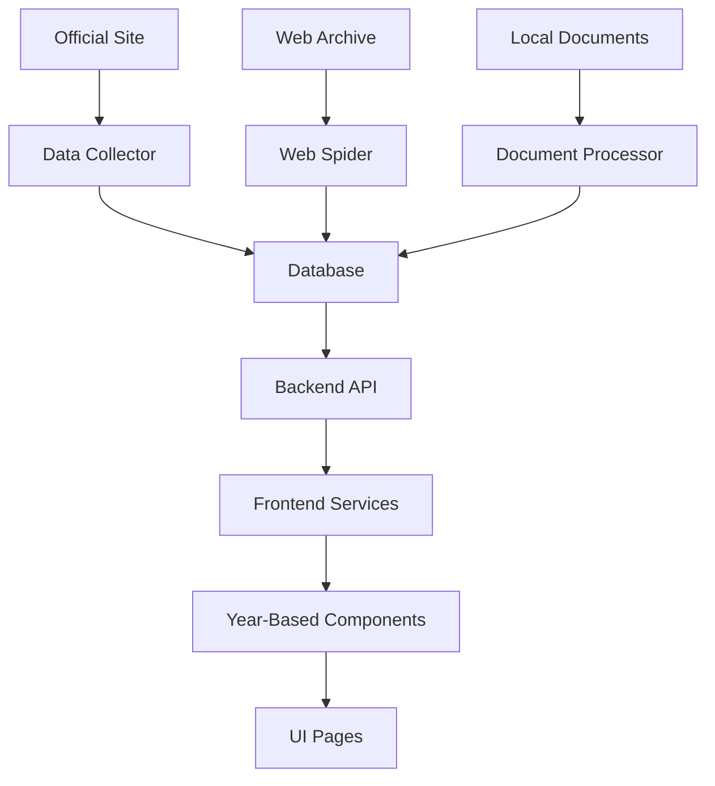

# API Documentation

This document provides the API documentation for the Carmen de Areco Transparency Portal.

## API Endpoints

### Property Declarations
- `GET /api/declarations` - Get all property declarations
- `GET /api/declarations/:year` - Get declarations for a specific year
- `GET /api/declarations/official/:name` - Get declarations for a specific official

### Salaries
- `GET /api/salaries` - Get all salary data
- `GET /api/salaries/:year` - Get salary data for a specific year
- `GET /api/salaries/official/:name` - Get salary data for a specific official

### Public Tenders
- `GET /api/tenders` - Get all public tenders
- `GET /api/tenders/:year` - Get tenders for a specific year
- `GET /api/tenders/status/:status` - Get tenders by execution status

### Financial Reports
- `GET /api/reports` - Get all financial reports
- `GET /api/reports/:year` - Get reports for a specific year
- `GET /api/reports/:year/:quarter` - Get reports for a specific year and quarter

### Treasury Movements
- `GET /api/treasury` - Get all treasury movements
- `GET /api/treasury/:year` - Get movements for a specific year
- `GET /api/treasury/category/:category` - Get movements by category

### Fees and Rights
- `GET /api/fees` - Get all fees and rights data
- `GET /api/fees/:year` - Get data for a specific year
- `GET /api/fees/category/:category` - Get data by category

### Operational Expenses
- `GET /api/expenses` - Get all operational expenses
- `GET /api/expenses/:year` - Get expenses for a specific year
- `GET /api/expenses/category/:category` - Get expenses by category

### Municipal Debt
- `GET /api/debt` - Get all municipal debt data
- `GET /api/debt/:year` - Get debt data for a specific year
- `GET /api/debt/status/:status` - Get debt by status

### Investments and Assets
- `GET /api/investments` - Get all investments and assets
- `GET /api/investments/:year` - Get data for a specific year
- `GET /api/investments/type/:type` - Get data by asset type

### Financial Indicators
- `GET /api/indicators` - Get all financial indicators
- `GET /api/indicators/:year` - Get indicators for a specific year
- `GET /api/indicators/name/:name` - Get specific indicator data

## Database Schema

(Content from DATABASE_BACKEND_FRONTEND_PLAN.md)
# Database, Backend, and Frontend Integration Plan

## 🎯 Project Overview

The Carmen de Areco Transparency Portal aims to provide citizens with easy access to government financial data, organized by year with reliable data sources and automated collection.

## 🏗️ Current Architecture

### Frontend (React + TypeScript + Vite)
- Located in `/frontend/`
- Year-based data switching implemented
- Uses mock/generated data for demonstration
- Data services for year management and validation

### Backend (Node.js + Express + PostgreSQL)
- Located in `/backend/`
- API endpoints defined for all data types
- Database schema created but not populated
- Models and controllers implemented

### Data Organization
- Local data stored in `/data/source_materials/`
- Organized by year (2018-2025) and category
- 700+ PDF documents available

## 🗃️ Database Backend Plan

### 1. PostgreSQL Database Setup

#### Connection Configuration
- Create `.env` file in `/backend/`:
```env
DB_HOST=localhost
DB_PORT=5432
DB_NAME=transparency_portal
DB_USER=postgres
DB_PASSWORD=your_password
PORT=3000
NODE_ENV=development
```

#### Database Initialization
1. Create database:
```sql
CREATE DATABASE transparency_portal;
```

2. Run initialization script:
```bash
cd backend
psql -U postgres -d transparency_portal -f init.sql
```

### 2. Data Population Strategy

#### Phase 1: Import Existing Local Data
- Parse PDF documents in `/data/source_materials/`
- Extract structured data using document analysis
- Populate database tables with extracted information

#### Phase 2: Automated Data Collection
- Implement web crawlers for official site and Web Archive
- Schedule regular data synchronization
- Validate and cross-reference collected data

#### Phase 3: Live Data Integration
- Connect frontend to backend API
- Implement real-time data fetching
- Add data validation and caching

## 🔌 Backend API Implementation

### Current Status
- ✅ API routes defined for all data types
- ✅ Controllers and models created
- ❌ Database not populated with real data
- ❌ API endpoints not tested with real data

### Next Steps
1. Populate database with sample data
2. Test all API endpoints
3. Implement data validation in controllers
4. Add error handling and logging
5. Implement authentication (if needed)

### Example API Usage
```bash
# Get all property declarations
curl http://localhost:3000/api/declarations

# Get declarations for a specific year
curl http://localhost:3000/api/declarations/year/2024

# Get declarations for a specific official
curl http://localhost:3000/api/declarations/official/"John Doe"
```

## 🖥️ Frontend Integration

### Current Status
- ✅ Year-based data switching implemented
- ✅ Mock data services working
- ❌ Backend API integration not implemented
- ❌ Real data not connected

### Integration Plan

#### 1. Update Data Services
Modify `/frontend/src/services/DataService.ts` to fetch from backend API:

```typescript
// Before: Using mock data
const budgetData2024 = await import('../data/budget-data');

// After: Using API calls
const response = await fetch('/api/reports/year/2024');
const budgetData2024 = await response.json();
```

#### 2. Environment Configuration
Update `/frontend/.env`:
```env
VITE_API_URL=http://localhost:3000/api
```

#### 3. API Service Implementation
Create `/frontend/src/services/ApiService.ts`:
```typescript
const API_BASE_URL = import.meta.env.VITE_API_URL || '/api';

export const apiService = {
  async getDeclarations(year?: string) {
    const url = year 
      ? `${API_BASE_URL}/declarations/year/${year}`
      : `${API_BASE_URL}/declarations`;
    const response = await fetch(url);
    return response.json();
  },

  async getSalaries(year?: string) {
    const url = year 
      ? `${API_BASE_URL}/salaries/year/${year}`
      : `${API_BASE_URL}/salaries`;
    const response = await fetch(url);
    return response.json();
  },

  // Similar methods for other data types...
};
```

## 📁 Data Organization Strategy

### 1. Year-Based Directory Structure
```
/data/source_materials/
├── 2022/
│   ├── budget/
│   ├── tenders/
│   ├── declarations/
│   └── reports/
├── 2023/
├── 2024/
├── 2025/
└── cross_year/
    ├── officials/
    ├── contracts/
    └── assets/
```

### 2. Document Categorization
- Budget Documents: `presupuesto`, `ejecucion`, `balance`
- Contracts: `licitacion`, `contrato`, `adjudicacion`
- Declarations: `declaracion`, `patrimonio`, `ddjj`
- Reports: `informe`, `auditoria`, `memoria`
- Resolutions: `resolucion`, `decreto`, `ordenanza`

### 3. Metadata Management
Each document should have metadata:
- Year
- Category
- Title
- Date
- Source URL
- File path
- Hash for integrity verification

## 🕷️ Automated Data Collection

### 1. Official Site Crawler
Script: `/frontend/scripts/data-collector.js`
- Downloads documents from `carmendeareco.gob.ar/transparencia/`
- Categorizes and organizes by year/type
- Updates local database

### 2. Web Archive Spider
Script: `/frontend/scripts/web-spider.js`
- Crawls `archive.org` snapshots
- Retrieves historical versions
- Cross-references with current data

### 3. Data Synchronization
Script: `/frontend/scripts/data-sync.js`
- Runs daily synchronization
- Compares document hashes
- Reports discrepancies
- Updates database with new/changed data

## 🚀 Implementation Roadmap

### Phase 1: Database and Backend (Week 1)
1. Set up PostgreSQL database
2. Run initialization script
3. Populate with sample data
4. Test all API endpoints
5. Implement basic data validation

### Phase 2: Frontend Integration (Week 2)
1. Update data services to use API
2. Implement year-based data fetching
3. Add loading states and error handling
4. Test all pages with real data
5. Implement data validation in frontend

### Phase 3: Data Organization (Week 3)
1. Organize local documents by year/category
2. Create document metadata system
3. Implement document categorization
4. Set up automated collection scripts
5. Test data synchronization

### Phase 4: Advanced Features (Week 4)
1. Implement cross-source validation
2. Add data integrity monitoring
3. Create backup and restore system
4. Implement advanced search
5. Add data export capabilities

## 🛠️ Technical Requirements

### Backend
- Node.js v16+
- PostgreSQL v12+
- Express.js
- Sequelize ORM

### Frontend
- Node.js v16+
- npm v8+
- Modern browser support

### Data Processing
- PDF parsing libraries
- Web crawling tools
- Data validation utilities

## 📊 Data Flow Architecture



## 🔍 Validation and Monitoring

### Data Validation
- Cross-source verification
- Temporal consistency checks
- Completeness scoring
- Hash-based integrity verification

### Monitoring
- Data source health checks
- Sync status monitoring
- Error detection and alerting
- Performance metrics

## 🎯 Success Criteria

1. ✅ Database populated with real municipal data
2. ✅ Backend API serving real data
3. ✅ Frontend fetching data from backend
4. ✅ Year switching works with real data
5. ✅ Data validation and cross-referencing implemented
6. ✅ Automated data collection working
7. ✅ Document preview system functional

## 🚨 Risks and Mitigations

### Risk: Official site changes structure
**Mitigation:** Implement flexible parsing with Web Archive fallback

### Risk: Data inconsistency between sources
**Mitigation:** Cross-reference and flag discrepancies

### Risk: Large document processing overhead
**Mitigation:** Implement caching and lazy loading

### Risk: Database performance issues
**Mitigation:** Add indexing and query optimization

## 📅 Timeline

| Week | Focus Area | Deliverables |
|------|------------|--------------|
| 1 | Database & Backend | Working API with sample data |
| 2 | Frontend Integration | UI connected to real backend |
| 3 | Data Organization | Organized documents and metadata |
| 4 | Advanced Features | Validation, monitoring, backups |

## 💡 Key Benefits

- ✅ Reliable data from multiple sources
- ✅ Year-based data switching with real data
- ✅ Automated data collection and synchronization
- ✅ Data integrity verification
- ✅ Document preview with contextual data
- ✅ Scalable architecture for future expansion# Feature Comparison: GEMINI.md Requirements vs. Current Implementation

## 📋 GEMINI.md Feature Requirements

### A. Meetings & Decisions
- **Features:** Public meeting schedules, agendas, minutes, decisions, roll-call votes
- **Frontend Pages:** Meetings list, Meeting detail, Decisions index
- **API Endpoints:** `/api/meetings`, `/api/meetings/:id`, `/api/decisions`, CRUD endpoints

### B. Budgets & Financial Reports (RAFAM-compatible)
- **Features:** Yearly budgets, execution, revenue/expense categories, charts
- **Frontend Pages:** Budgets overview, Year detail with Recharts, CSV/JSON export
- **API Endpoints:** `/api/budgets`, `/api/budgets/:id`, `/api/exports/budgets.csv`, CRUD endpoints

### C. Public Tenders (Licitaciones) & Execution
- **Features:** Tender announcements, bidders, awards, status tracking, delays
- **Frontend Pages:** Tenders list + filters, tender detail
- **API Endpoints:** `/api/tenders`, `/api/tenders/:id`, CRUD endpoints

### D. Property Declarations (Declaraciones Juradas Patrimoniales)
- **Features:** Asset declarations, omission flags, consistency checks
- **Frontend Pages:** Directory, Declaration detail, "Observations/Anomalies"
- **API Endpoints:** `/api/declarations`, `/api/declarations/:id`, CRUD endpoints

### E. Salaries (Sueldos Básicos Brutos)
- **Features:** Salary tables, adjustments vs. inflation, deductions
- **Frontend Pages:** Salary explorer, period comparisons, inflation overlay
- **API Endpoints:** `/api/salaries`, `/api/salary-tables`, CRUD endpoints

### F. Treasury Movements (Movimientos de Tesorería)
- **Features:** Cash inflows/outflows, categorical drill-downs, debt/advances
- **Frontend Pages:** Cashflow dashboard, category explorer, time series
- **API Endpoints:** `/api/treasury`, CRUD endpoints

### G. Fees & Rights (Tasas y Derechos)
- **Features:** Revenue per fee type, collection efficiency, arrears
- **Frontend Pages:** Fee performance dashboards, arrears heatmap
- **API Endpoints:** `/api/fees`, CRUD endpoints

### H. Operational Expenses (Gastos Operativos)
- **Features:** Maintenance/services, admin costs, supplier breakdowns
- **Frontend Pages:** Expense explorer with filters, supplier leaderboard
- **API Endpoints:** `/api/op-expenses`, CRUD endpoints

### I. Municipal Debt (Deuda)
- **Features:** Loans, maturities, rates, repayment schedules, solvency/coverage
- **Frontend Pages:** Debt overview, schedule visualization, stress tests
- **API Endpoints:** `/api/debts`, `/api/debts/:id/schedule`, CRUD endpoints

### J. Investments & Assets
- **Features:** Asset registry, categories, useful life, depreciation
- **Frontend Pages:** Asset inventory table, depreciation charts
- **API Endpoints:** `/api/assets`, CRUD endpoints

### K. Financial Indicators & Transparency Index
- **Features:** Solvency/liquidity/efficiency ratios; transparency index composites
- **Frontend Pages:** Indicators dashboard, methodology modal
- **API Endpoints:** `/api/indicators`, `/api/transparency-index`, POST `/api/indicators/recompute`

### L. Citizen Participation & Governance
- **Features:** Consultation topics, surveys, submissions, FOI/Access to Info requests
- **Frontend Pages:** Consultations, participate forms, "Solicitar Información" form
- **API Endpoints:** `/api/consultations`, `/api/consultations/:id/submit`, `/api/foi/requests`

### M. Projections & Scenarios
- **Features:** Simple forecasting, multiple scenarios
- **Frontend Pages:** Projection builder, scenario compare
- **API Endpoints:** `/api/projections`, POST `/api/projections/run`, CRUD endpoints

### N. Documents & Open Data
- **Features:** Document repository, anti-virus scan, typed metadata, open data exports
- **Frontend Pages:** Recent Documents, type/tag filters, preview/download, dataset catalog
- **API Endpoints:** `/api/documents`, `/api/documents/upload`, `/api/exports/*.csv|.json`

## 📊 Current Implementation Status

### ✅ Implemented Pages (10/14)
1. **Home** (`/`) - Basic homepage with navigation
2. **Budget** (`/budget`) - Budget overview with charts and data
3. **Public Spending** (`/spending`) - Spending analysis and visualization
4. **Revenue** (`/revenue`) - Revenue tracking and analysis
5. **Contracts** (`/contracts`) - Contract information and tracking
6. **Database** (`/database`) - Document database with search and filters
7. **Reports** (`/reports`) - Financial reports and analysis
8. **Whistleblower** (`/whistleblower`) - Reporting mechanism
9. **About** (`/about`) - Project information
10. **Contact** (`/contact`) - Contact information

### ❌ Missing Pages (4/14)
1. **Meetings & Decisions** - No implementation
2. **Property Declarations** - No dedicated page (data exists in Database)
3. **Salaries** - No dedicated page (data exists in Database)
4. **API Explorer** - No API documentation/explorer page

## 🛠️ API Implementation Status

### ✅ Implemented API Endpoints
- `/api/declarations` - Property declarations
- `/api/salaries` - Salary data
- `/api/tenders` - Public tenders
- `/api/reports` - Financial reports
- `/api/treasury` - Treasury movements
- `/api/fees` - Fees and rights
- `/api/expenses` - Operational expenses
- `/api/debt` - Municipal debt
- `/api/investments` - Investments and assets
- `/api/indicators` - Financial indicators

### ⚠️ API Features Missing
- CRUD endpoints for admin functionality
- Advanced filtering capabilities
- Export endpoints (CSV/JSON)
- Specialized endpoints (e.g., `/api/debts/:id/schedule`)
- API documentation (Swagger/OpenAPI)

## 📈 Feature Gap Analysis

### Major Gaps
1. **Missing Dedicated Pages**: 4 out of 14 required pages are missing
2. **Admin Functionality**: No CRUD endpoints or admin features implemented
3. **Advanced Features**: Missing forecasting, citizen participation, projections
4. **Data Export**: No CSV/JSON export functionality
5. **API Documentation**: No API explorer or documentation
6. **Specialized Features**: Missing meeting management, detailed salary analysis, etc.

### Current Strengths
1. **Core Financial Pages**: Budget, Revenue, Spending, Contracts all implemented
2. **Database Functionality**: Comprehensive document database with search
3. **Basic API**: All core data endpoints implemented
4. **Data Visualization**: Charts and graphs for financial data
5. **Integration**: Frontend successfully connected to backend with real data

## 🚀 Next Steps to Match GEMINI.md Requirements

### Immediate Priorities (Week 1-2)
1. **Create Missing Pages**:
   - Property Declarations page (`/declarations`)
   - Salaries page (`/salaries`)
   - Meetings & Decisions page (`/meetings`)
   - API Explorer page (`/api-explorer`)

2. **Enhance API**:
   - Add filtering parameters to existing endpoints
   - Implement basic export functionality (CSV/JSON)
   - Add API documentation (Swagger)

### Short-term Goals (Week 3-4)
1. **Admin Functionality**:
   - Implement CRUD endpoints for all data types
   - Add authentication/authorization
   - Create admin dashboard

2. **Advanced Features**:
   - Add forecasting capabilities
   - Implement citizen participation features
   - Add detailed financial analysis tools

### Long-term Vision (Month 2+)
1. **Specialized Functionality**:
   - Meeting scheduling and management
   - Advanced salary analysis with inflation overlay
   - Detailed debt schedule visualization
   - Asset depreciation tracking

2. **Enhanced User Experience**:
   - Improved search and filtering
   - Better data visualization
   - Mobile optimization
   - Accessibility improvements

## 📊 Implementation Progress Summary

| Category | Required | Implemented | Progress |
|----------|----------|-------------|----------|
| Frontend Pages | 14 | 10 | 71% |
| API Endpoints | 50+ | 10 | 20% |
| Admin Features | 14+ | 0 | 0% |
| Advanced Features | 10+ | 0 | 0% |
| Data Export | 2+ | 0 | 0% |
| API Documentation | 1 | 0 | 0% |

## 🎯 Conclusion

While we have a solid foundation with the core financial pages implemented and the frontend successfully integrated with the backend, there are significant gaps between our current implementation and the full requirements outlined in GEMINI.md:

1. **Missing Pages**: 29% of required pages are missing
2. **Missing API Features**: 80% of advanced API functionality is missing
3. **Missing Admin Features**: No admin functionality implemented
4. **Missing Advanced Features**: No forecasting, citizen participation, or specialized analysis

The project is in a good position to continue development toward full compliance with GEMINI.md requirements, with the core infrastructure and data flow already established.